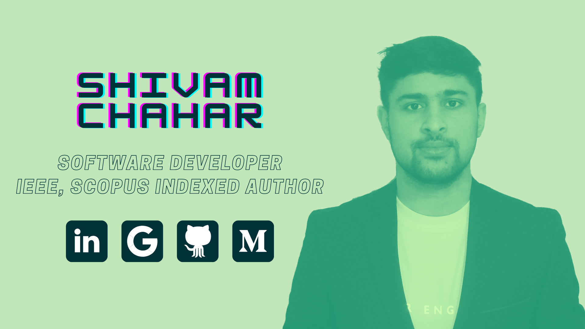

# Hi, I'm Shivam 👋

    

A software engineering student with a passion for creating beautiful programs. Loves to figure out the answer to “WHY” and “HOW”, expanding my knowledge base, and building technology to elevate people. I have a strong grasp of Python and am interested in working in the research field. Over the last year, I've written three research articles, two of which have been published in peer-reviewed high-impact journals, including "IEEE Transactions on Artificial Intelligence" and the "Archives of Computational Methods in Engineering" (SCI-indexed Q1 journal) and a paper was accepted in International conference.
    

<i></i>
    

A software engineering student with a passion for creating beautiful programs. Loves to figure out the answer to “WHY” and “HOW”, expanding my knowledge base, and building technology to elevate people. I have a strong grasp of Python and am interested in working in the research field. Over the last year, I've written three research articles, two of which have been published in peer-reviewed high-impact journals, including "IEEE Transactions on Artificial Intelligence" and the "Archives of Computational Methods in Engineering" (SCI-indexed Q1 journal) and a paper was accepted in International conference.
    

|    👾 Find more about me around the web    |                                                                                                                                                                                                                           |
|:------------------------------------------:|:-------------------------------------------------------------------------------------------------------------------------------------------------------------------------------------------------------------------------:|
|           Sharing updates on...            |                                       |
| Take a look at my academic publications... |  |
|           Check out my blogs...            |                                                     |
|   Take a peek at some of my creations...   |                                                       |
|               To email me...               |                                                           |
|    Here's a link to my IEEE profile...     |                                              |
|  For your convenience, here's my orcid...  |                                                    |

### 
<b>Main Technical Skills</b>

<i><b>Programming Languages</b></i>
    

    

<i><b>Frontend Development</b></i>
    

    

<i><b>Backend Development</b></i>
    

    

<i><b>Database Management</b></i>
    

    

<i><b>DevOps</b></i>
    

    

<i><b>Machine Learning Frameworks</b></i>
    

    

### 
<b>Other Knowledge, Always Learning</b>

<i></i>
    

    

### 
<b>GitHub Statistics</b>

<i></i>
    
  

    

<i></i>
    
  

    

